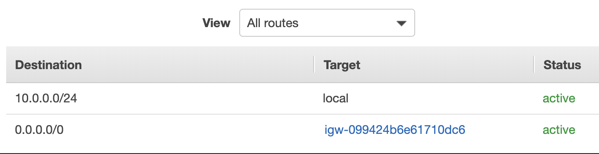

# VPC

## VPC

A VPC is a virtual private cloud hat allows us to provision a logically isolated section of the AWS Cloud where we can launch AWS resources. It is the networking layer for Amazon EC2.

## Subnet

A subnet is simply a range of IP addresses in the VPC.

## Route Table

A route table contains a set of rules, called routes, taht are used to determine where network traffic is directed.

## Internet Gateway

A horizontally scaled, redundant, and highly available VPC component that allows communication between instances in your VPC and the internet. It therefore imposes no availability risks or bandwidth constraints on your network traffic.

